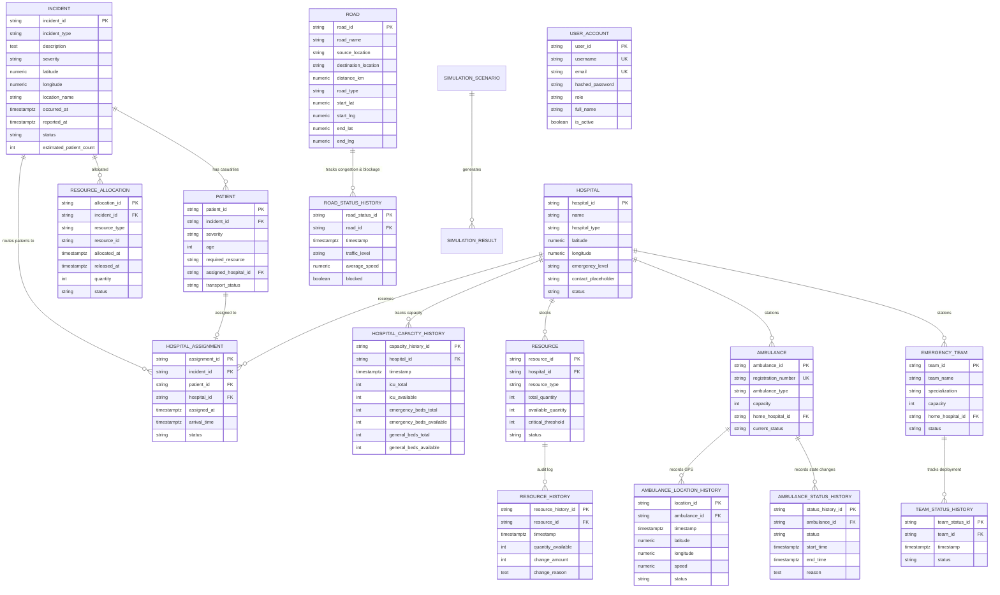

# TERA Entity-Relationship (ER) Diagram

```mermaid
erDiagram
    INCIDENT ||--o{ PATIENT : "has casualties"
    INCIDENT ||--o{ RESOURCE_ALLOCATION : "allocated"
    INCIDENT ||--o{ HOSPITAL_ASSIGNMENT : "routes patients to"
    
    PATIENT ||--o| HOSPITAL_ASSIGNMENT : "assigned to"
    HOSPITAL ||--o{ HOSPITAL_ASSIGNMENT : "receives"
    
    HOSPITAL ||--o{ HOSPITAL_CAPACITY_HISTORY : "tracks capacity"
    HOSPITAL ||--o{ RESOURCE : "stocks"
    HOSPITAL ||--o{ AMBULANCE : "stations"
    HOSPITAL ||--o{ EMERGENCY_TEAM : "stations"
    
    RESOURCE ||--o{ RESOURCE_HISTORY : "audit log"
    
    AMBULANCE ||--o{ AMBULANCE_LOCATION_HISTORY : "records GPS"
    AMBULANCE ||--o{ AMBULANCE_STATUS_HISTORY : "records state changes"
    
    ROAD ||--o{ ROAD_STATUS_HISTORY : "tracks congestion & blockage"
    
    EMERGENCY_TEAM ||--o{ TEAM_STATUS_HISTORY : "tracks deployment"
    
    SIMULATION_SCENARIO ||--o{ SIMULATION_RESULT : "generates"

    INCIDENT {
        string incident_id PK
        string incident_type
        text description
        string severity
        numeric latitude
        numeric longitude
        string location_name
        timestamptz occurred_at
        timestamptz reported_at
        string status
        int estimated_patient_count
    }

    PATIENT {
        string patient_id PK
        string incident_id FK
        string severity
        int age
        string required_resource
        string assigned_hospital_id FK
        string transport_status
    }

    HOSPITAL {
        string hospital_id PK
        string name
        string hospital_type
        numeric latitude
        numeric longitude
        string emergency_level
        string contact_placeholder
        string status
    }

    HOSPITAL_CAPACITY_HISTORY {
        string capacity_history_id PK
        string hospital_id FK
        timestamptz timestamp
        int icu_total
        int icu_available
        int emergency_beds_total
        int emergency_beds_available
        int general_beds_total
        int general_beds_available
    }

    AMBULANCE {
        string ambulance_id PK
        string registration_number UK
        string ambulance_type
        int capacity
        string home_hospital_id FK
        string current_status
    }

    AMBULANCE_LOCATION_HISTORY {
        string location_id PK
        string ambulance_id FK
        timestamptz timestamp
        numeric latitude
        numeric longitude
        numeric speed
        string status
    }

    AMBULANCE_STATUS_HISTORY {
        string status_history_id PK
        string ambulance_id FK
        string status
        timestamptz start_time
        timestamptz end_time
        text reason
    }

    RESOURCE {
        string resource_id PK
        string hospital_id FK
        string resource_type
        int total_quantity
        int available_quantity
        int critical_threshold
        string status
    }

    RESOURCE_HISTORY {
        string resource_history_id PK
        string resource_id FK
        timestamptz timestamp
        int quantity_available
        int change_amount
        text change_reason
    }

    ROAD {
        string road_id PK
        string road_name
        string source_location
        string destination_location
        numeric distance_km
        string road_type
        numeric start_lat
        numeric start_lng
        numeric end_lat
        numeric end_lng
    }

    ROAD_STATUS_HISTORY {
        string road_status_id PK
        string road_id FK
        timestamptz timestamp
        string traffic_level
        numeric average_speed
        boolean blocked
    }

    EMERGENCY_TEAM {
        string team_id PK
        string team_name
        string specialization
        int capacity
        string home_hospital_id FK
        string status
    }

    TEAM_STATUS_HISTORY {
        string team_status_id PK
        string team_id FK
        timestamptz timestamp
        string status
    }

    RESOURCE_ALLOCATION {
        string allocation_id PK
        string incident_id FK
        string resource_type
        string resource_id
        timestamptz allocated_at
        timestamptz released_at
        int quantity
        string status
    }

    HOSPITAL_ASSIGNMENT {
        string assignment_id PK
        string incident_id FK
        string patient_id FK
        string hospital_id FK
        timestamptz assigned_at
        timestamptz arrival_time
        string status
    }

    USER_ACCOUNT {
        string user_id PK
        string username UK
        string email UK
        string hashed_password
        string role
        string full_name
        boolean is_active
    }
```
